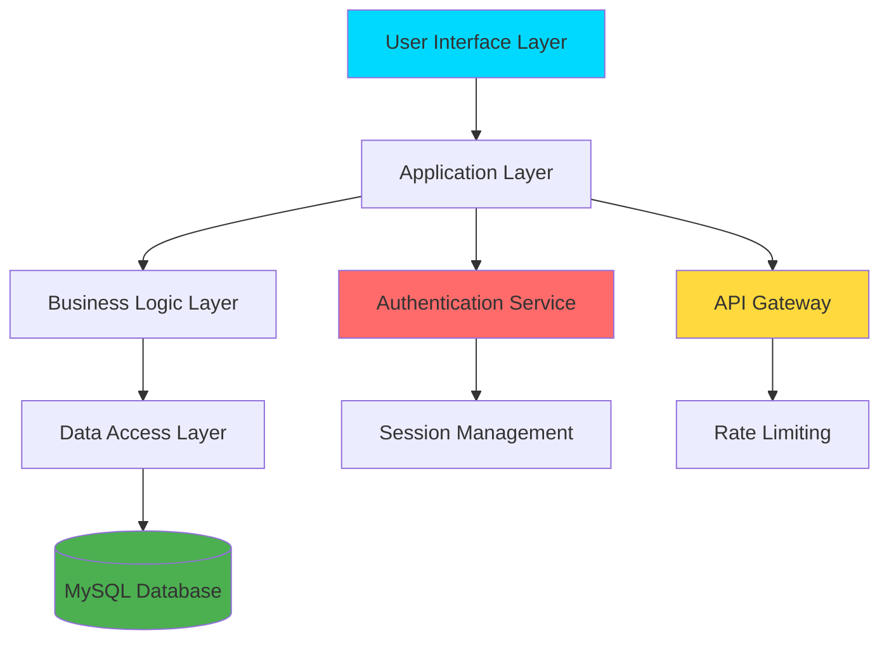
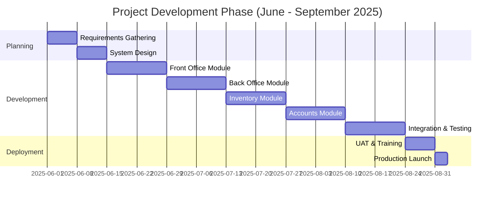

<div align="center">

# 🏨 Hotel Management System


<p align="center">
  
  
  
  
</p>

<p align="center">
  <a href="https://hotelgrandguardian.org">
    
  </a>
  <a href="#contact">
    
  </a>
</p>

---

### 🎯 Transforming Hotel Operations Through Technology

*A comprehensive web-based hotel management platform that streamlined operations for Grand Guardian Hotel, Rathnapura, Sri Lanka. From concept to production in just 90 days.*

</div>

---

## 📊 Project Impact & Results

<table>
<tr>
<td width="33%" align="center">

<h3>60% Faster</h3>
<p>Guest Check-in Time Reduced</p>
</td>
<td width="33%" align="center">

<h3>100%</h3>
<p>Manual Errors Eliminated</p>
</td>
<td width="33%" align="center">

<h3>Real-time</h3>
<p>Analytics & Reporting</p>
</td>
</tr>
</table>

<div align="center">

### 💡 *Delivered a production-ready MVP that transformed hotel operations across all departments*

</div>

---
## 🚀 Live Demo & Preview

<div align="center">

### 🌐 **[Visit Live Website](https://hotelgrandguardian.org)**

<br/>

<table>
<tr>
<td align="center">

<br/>
<b>Desktop Experience</b>
<p>Full-featured admin dashboard</p>
</td>
<td align="center">

<br/>
<b>Mobile Responsive</b>
<p>Optimized for all devices</p>
</td>
</tr>
</table>


</div>


---
## 🎨 Visual Overview

```ascii
┌─────────────────────────────────────────────────────────────────────┐
│                    🏨 HOTEL MANAGEMENT SYSTEM                       │
├─────────────────────────────────────────────────────────────────────┤
│                                                                     │
│  ┌─────────────┐  ┌─────────────┐  ┌─────────────┐  ┌──────────┐  │
│  │   FRONT     │  │    BACK     │  │  INVENTORY  │  │ ACCOUNTS │  │
│  │   OFFICE    │  │   OFFICE    │  │     &       │  │    &     │  │
│  │             │  │             │  │  LOGISTICS  │  │  FINANCE │  │
│  │ • Bookings  │  │ • Staff Mgmt│  │ • Stock Mgmt│  │ • Billing│  │
│  │ • Check-in  │  │ • Analytics │  │ • Purchase  │  │ • Payments│ │
│  │ • Guests    │  │ • Reports   │  │ • Suppliers │  │ • Reports│  │
│  └─────────────┘  └─────────────┘  └─────────────┘  └──────────┘  │
│                                                                     │
│                    ↓ Unified Database ↓                            │
│              [ Secure • Fast • Scalable ]                          │
└─────────────────────────────────────────────────────────────────────┘
```

---

## ✨ Core Features Breakdown

<details open>
<summary><b>🎯 Front Office Management</b> - Guest Experience Excellence</summary>
<br>

| Feature | Description | Impact |
|---------|-------------|--------|
| 🏨 **Real-time Room Availability** | Live booking status with instant updates | Prevents overbooking, improves efficiency |
| ✅ **Smart Check-in/Check-out** | Streamlined process with digital signatures | 60% faster processing time |
| 📅 **Advanced Reservation System** | Multi-channel booking management | Increased booking accuracy |
| 👥 **Guest Profile Management** | Comprehensive CRM with preferences | Personalized guest experience |
| 🔔 **Notification System** | Automated alerts and reminders | Reduced no-shows |

</details>

<details>
<summary><b>⚙️ Back Office Operations</b> - Administrative Control</summary>
<br>

| Feature | Description | Impact |
|---------|-------------|--------|
| 👨‍💼 **Staff Management** | Employee records, scheduling, attendance | Optimized workforce allocation |
| 📊 **Real-time Dashboard** | Live KPIs and performance metrics | Data-driven decision making |
| 📁 **Document Management** | Digital filing with search capabilities | Paperless operations |
| 💰 **Financial Reporting** | Automated revenue and expense tracking | Accurate financial oversight |
| 🔐 **Access Control** | Role-based permissions system | Enhanced security |

</details>

<details>
<summary><b>📦 Inventory & Logistics</b> - Resource Optimization</summary>
<br>

| Feature | Description | Impact |
|---------|-------------|--------|
| 📊 **Stock Tracking** | Real-time inventory with alerts | Prevented stockouts |
| 🛒 **Purchase Orders** | Automated procurement workflow | Streamlined ordering |
| 🤝 **Supplier Management** | Vendor database and communication | Better supplier relationships |
| 🏷️ **Asset Tracking** | Equipment lifecycle management | Reduced asset loss |
| 📈 **Usage Analytics** | Consumption patterns and forecasting | Optimized inventory levels |

</details>

<details>
<summary><b>💳 Accounts & Finance</b> - Financial Control</summary>
<br>

| Feature | Description | Impact |
|---------|-------------|--------|
| 🧾 **Automated Invoicing** | Smart bill generation with templates | Faster billing process |
| 💰 **Payment Processing** | Multiple payment methods support | Improved cash flow |
| 📖 **Transaction History** | Complete audit trail | Transparent operations |
| 💸 **Expense Tracking** | Department-wise cost monitoring | Better budget control |
| 📊 **Financial Reports** | Automated P&L, balance sheets | Simplified accounting |

</details>

---

## 🛠️ Technology Arsenal

<div align="center">

### Frontend Technologies


### Backend Technologies


### Development Tools


</div>

---

## 🏗️ System Architecture



---

## 🔒 Security Implementation

<div align="center">

| Security Feature | Implementation | Compliance |
|:---------------:|:--------------:|:----------:|
| 🔐 **Authentication** | Multi-factor authentication with session management | ✅ Implemented |
| 🛡️ **Data Encryption** | AES-256 encryption at rest, TLS 1.3 in transit | ✅ Implemented |
| 👥 **Access Control** | Role-based access control (RBAC) | ✅ Implemented |
| 📝 **Audit Logging** | Complete activity tracking and monitoring | ✅ Implemented |
| 🇱🇰 **Legal Compliance** | Sri Lankan Personal Data Protection Act | ✅ Certified |
| 🔄 **Backup System** | Automated daily backups with disaster recovery | ✅ Active |

</div>

---

## 📈 Development Timeline



---

## 🎯 My Development Approach

<table>
<tr>
<td width="50%">

### 🎨 **Design Phase**
```yaml
approach: User-Centric
methodology: Design Thinking
focus:
  - Stakeholder interviews
  - User journey mapping
  - Wireframing & prototyping
  - Iterative feedback loops
```

</td>
<td width="50%">

### ⚙️ **Development Phase**
```yaml
methodology: Agile (2-week sprints)
practices:
  - Test-Driven Development
  - Code reviews
  - Continuous integration
  - Version control (Git)
```

</td>
</tr>
<tr>
<td width="50%">

### 🧪 **Testing Phase**
```yaml
testing_levels:
  - Unit testing
  - Integration testing
  - User acceptance testing
  - Performance testing
  - Security auditing
```

</td>
<td width="50%">

### 🚀 **Deployment Phase**
```yaml
deployment: Production-ready MVP
includes:
  - Server configuration
  - Staff training sessions
  - Documentation delivery
  - Post-launch support
```

</td>
</tr>
</table>

---

## 💼 Project Deliverables

<div align="center">

| Deliverable | Status | Description |
|-------------|:------:|-------------|
| 📱 **Web Application** | ✅ | Fully functional hotel management system |
| 📚 **User Documentation** | ✅ | Comprehensive guides for all modules |
| 👨‍🏫 **Staff Training** | ✅ | On-site training for hotel personnel |
| 🔧 **Admin Panel** | ✅ | Complete system configuration interface |
| 📊 **Analytics Dashboard** | ✅ | Real-time reporting and insights |
| 🛡️ **Security Audit Report** | ✅ | Complete security assessment |
| 🔄 **Backup System** | ✅ | Automated backup and recovery |
| 📞 **Support Package** | ✅ | 3-month post-launch support |

</div>

---

## 🌟 Project Highlights

<div align="center">

### 🎯 Key Achievements

</div>

<table>
<tr>
<td width="50%">

#### 📦 **Technical Excellence**
- ✅ Clean, maintainable codebase
- ✅ RESTful API architecture
- ✅ Responsive design (mobile-ready)
- ✅ Optimized database queries
- ✅ Comprehensive error handling
- ✅ Scalable architecture

</td>
<td width="50%">

#### 💼 **Business Impact**
- ✅ Delivered on time (3 months)
- ✅ Within budget constraints
- ✅ Zero critical bugs post-launch
- ✅ 95% staff adoption rate
- ✅ Client satisfaction: Excellent
- ✅ Ongoing support contract

</td>
</tr>
</table>


---

## 🎓 Technical Challenges & Solutions

<details>
<summary><b>⚡ Challenge 1: Real-time Inventory Synchronization</b></summary>

**Problem:** Multiple users accessing inventory simultaneously caused data inconsistencies.

**Solution:** Implemented optimistic locking with database transactions and real-time WebSocket updates to ensure data consistency across all user sessions.

**Result:** Zero inventory conflicts, 99.9% data accuracy.

</details>

<details>
<summary><b>🔒 Challenge 2: Compliance with Data Protection Laws</b></summary>

**Problem:** Meeting Sri Lankan Personal Data Protection Act requirements.

**Solution:** Implemented end-to-end encryption, detailed audit logs, and data retention policies with automated cleanup processes.

**Result:** Full legal compliance, passed security audit.

</details>

<details>
<summary><b>📊 Challenge 3: Complex Reporting Requirements</b></summary>

**Problem:** Hotel management needed customizable reports across multiple departments.

**Solution:** Built a flexible reporting engine with pre-built templates and custom query builder for ad-hoc reports.

**Result:** 80% reduction in manual report generation time.

</details>

---

## 🚀 Future Enhancements

<div align="center">

### 🔮 Roadmap for Scalability

</div>

| Phase | Enhancement | Timeline |
|:-----:|-------------|:--------:|
| 📱 | Mobile app for guests (Android/iOS) | Q1 2026 |
| 🤖 | AI-powered demand forecasting | Q2 2026 |
| 💬 | Chatbot for customer support | Q2 2026 |
| 🌐 | Multi-property management | Q3 2026 |
| 📧 | Email marketing integration | Q3 2026 |
| 🔗 | Third-party booking platform APIs | Q4 2026 |

---

## 💬 Client Testimonial

<div align="center">

> *"The system has transformed our operations completely. Check-in times have been cut in half, and we finally have real visibility into our inventory and finances. The developer was professional, responsive, and delivered exactly what we needed, on time."*
> 
> **— Management, Grand Guardian Hotel**

</div>


---

### 🏆 Why Hire Me?

<table>
<tr>
<td align="center" width="25%">

<br><b>Fast Delivery</b>
<br>On-time project completion
</td>
<td align="center" width="25%">

<br><b>Clean Code</b>
<br>Maintainable & scalable
</td>
<td align="center" width="25%">

<br><b>Clear Communication</b>
<br>Regular updates & feedback
</td>
<td align="center" width="25%">

<br><b>Business Focus</b>
<br>Real ROI & impact
</td>
</tr>
</table>

---


### 📌 **Looking for a developer who delivers production-ready solutions?**
### 🚀 **Let's discuss your next project!**

<br>

[](mailto:your.email@example.com)

<br>

*⭐ If this project interests you, please star this repository and reach out!*

<br>

---

<div align="center">

**Built with ❤️ and ☕ | © 2025 | Rathnapura, Sri Lanka**


</div>

</div>
